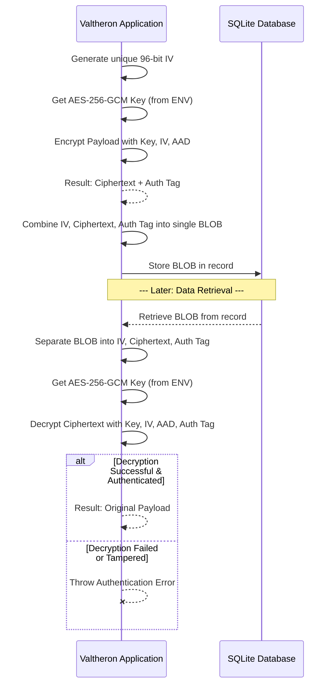
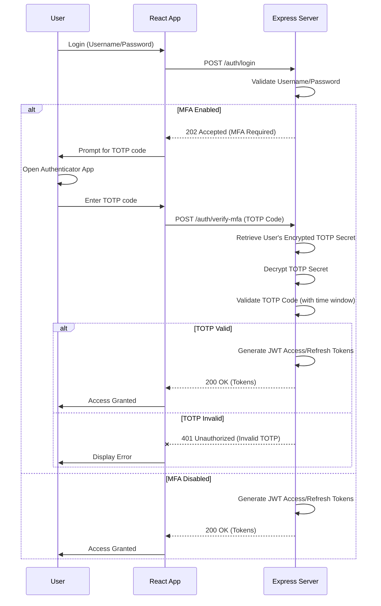
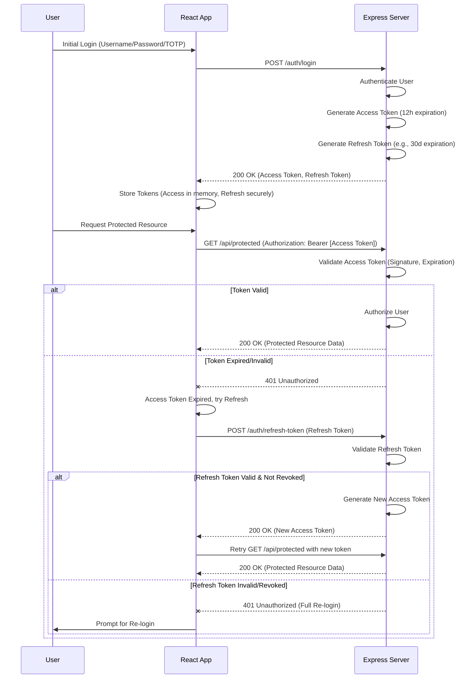

As the Lead Maintainer and Architect of the Valtheron Agentic Workspace, I'm delighted to guide you through this critical refactoring task. Our goal is to transform the existing `security_brief.pdf` into a highly structured, production-ready Markdown document: `docs/architecture/security-model.md`. This new document will serve as the definitive guide to our security architecture, ensuring clarity, consistency, and adherence to best practices.

This tutorial will walk you through the conceptual underpinnings and practical implementation details of our security model, focusing on AES-256-GCM encryption, TOTP Multi-Factor Authentication, and JWT-based authentication. We'll leverage TypeScript for robust type safety, and adhere to React 19 and Express 5.1 conventions.

---

# Valtheron Agentic Workspace Security Model

## 1. Executive Summary

The Valtheron Agentic Workspace prioritizes robust security through a multi-layered defense-in-depth approach. This document outlines our core security mechanisms, including:

*   **AES-256-GCM Encryption**: Employed universally for data at rest, ensuring confidentiality and integrity of sensitive payloads stored in SQLite databases.
*   **Time-Based One-Time Password (TOTP) Multi-Factor Authentication (MFA)**: Enhances user account security by requiring a second factor for authentication.
*   **JSON Web Token (JWT) Authentication**: Secures API endpoints, managing user sessions and authorization with carefully considered expiration policies.
*   **Secure Configuration Management**: Emphasizing the use of environment variables for sensitive keys and secrets.

This model is designed to be transparent, auditable, and extensible, providing a strong foundation for a secure agentic workspace.

## 2. Conceptual Explanation

Security is not an afterthought at Valtheron; it's an integral part of our architecture. We adhere to principles of least privilege, defense in depth, and secure by design.

### 2.1 Data Encryption: AES-256-GCM

**AES-256-GCM (Advanced Encryption Standard with Galois/Counter Mode)** is our chosen algorithm for protecting data at rest. It provides both **confidentiality** (ensuring data cannot be read by unauthorized parties) and **authenticity/integrity** (ensuring data has not been tampered with).

*   **Why GCM?** GCM is an authenticated encryption mode, meaning it produces an authentication tag alongside the ciphertext. This tag can be used during decryption to verify that the ciphertext and any associated data (AAD) have not been altered.
*   **Key Components**:
    *   **Encryption Key**: A 256-bit (32-byte) secret key, crucial for both encryption and decryption. These keys are rotated periodically (e.g., monthly) to mitigate risks associated with long-term key compromise.
    *   **Initialization Vector (IV)**: A unique, non-secret random value used for each encryption operation. For GCM, the IV should be 96 bits (12 bytes) long. It's essential that an IV is never reused with the same key. The IV is typically stored alongside the ciphertext.
    *   **Associated Authenticated Data (AAD)**: Optional, non-secret data that is authenticated but not encrypted. This can be useful for binding the ciphertext to specific context (e.g., a user ID, a record ID) without encrypting that context itself.
    *   **Ciphertext**: The encrypted data.
    *   **Authentication Tag**: A fixed-size tag generated by GCM that verifies the integrity and authenticity of both the ciphertext and the AAD.
*   **Storage in SQLite**: Encrypted payloads, along with their respective IVs and authentication tags, are packed into binary arrays (`BLOB` type in SQLite) before storage. This ensures that the entire encrypted package is treated as a single unit.

#### Data Encryption/Decryption Flow (Mermaid Diagram)



### 2.2 Multi-Factor Authentication: TOTP

**TOTP (Time-Based One-Time Password)** provides a second layer of security beyond traditional password authentication. It uses a shared secret key and the current time to generate a unique, short-lived code.

*   **How it Works**:
    1.  **Enrollment**: The server generates a unique secret key for the user, stores it (encrypted), and presents it to the user (usually as a QR code). The user scans this with an authenticator app (e.g., Google Authenticator, Authy).
    2.  **Generation**: The authenticator app uses the shared secret and the current time (divided into 30-second windows) to generate a 6-8 digit code.
    3.  **Validation**: During login, the user enters their password and the TOTP code. The server, using the same shared secret and its own current time, generates a code and compares it with the user's input. A small time-drift window (e.g., +/- 1 time step) is typically allowed.
*   **Secret Key**: The TOTP secret key must be securely generated and stored. While the underlying secret is typically 160 bits (20 bytes), it's often represented in **Base32 encoding**. A 20-byte secret encoded in Base32 results in a **32-character string** (e.g., `JBSWY3DPEHPK3PXP`). This 32-character length is a common requirement for many authenticator libraries and apps.

#### TOTP Enrollment & Validation Flow (Mermaid Diagram)



### 2.3 Authentication & Authorization: JWT

**JSON Web Tokens (JWTs)** are used for securely transmitting information between parties as a JSON object. They are compact, URL-safe, and digitally signed, providing authenticity.

*   **Structure**: A JWT consists of three parts separated by dots (`.`): Header, Payload, and Signature.
    *   **Header**: Typically contains the token type (JWT) and the signing algorithm (e.g., HS256, RS256).
    *   **Payload**: Contains claims (statements about an entity, typically the user, and additional data).
    *   **Signature**: Created by signing the encoded Header and Payload with a secret key. This ensures the token hasn't been tampered with.
*   **Usage**: Upon successful authentication (including MFA if enabled), the server issues an **Access Token** (short-lived) and optionally a **Refresh Token** (longer-lived).
    *   **Access Token**: Sent with every request to protected endpoints in the `Authorization` header. It grants immediate access.
    *   **Refresh Token**: Used to obtain new access tokens without requiring the user to re-authenticate with credentials. It should be stored securely and have a longer expiration.
*   **Expiration**:
    *   **Access Token**: Our current policy is **12 hours**. This provides a balance between user convenience and security. For highly sensitive operations, a shorter lifespan (e.g., 15-60 minutes) combined with a robust refresh token mechanism might be considered. This will be subject to ongoing security review.
    *   **Refresh Token**: Typically much longer (e.g., 7 days to 30 days) but should be revokable.
*   **Secure Endpoints**: All secure API endpoints are guarded by authentication middleware that validates the incoming JWT. The secret key used for signing/verifying JWTs **must always be read from secure server environment variables** and never hardcoded.

#### JWT Authentication Flow (Mermaid Diagram)



## 3. Step-by-Step Code Examples

### 3.1 Data Encryption/Decryption Service (Express 5.1 / TypeScript)

This service will handle the AES-256-GCM operations. We'll use Node.js's built-in `crypto` module.

```typescript
// src/services/encryptionService.ts
import crypto from 'crypto';

/**
 * Interface for encrypted data storage.
 * We store IV and Auth Tag alongside the ciphertext.
 */
export interface EncryptedPayload {
  iv: string;         // Base64 encoded Initialization Vector
  encryptedData: string; // Base64 encoded Ciphertext
  authTag: string;    // Base64 encoded Authentication Tag
}

// Ensure the encryption key is loaded from environment variables
// NEVER hardcode this in production.
const ENCRYPTION_KEY_HEX = process.env.AES_256_GCM_KEY;

if (!ENCRYPTION_KEY_HEX || ENCRYPTION_KEY_HEX.length !== 64) { // 32 bytes * 2 hex chars = 64
  console.error('ERROR: AES_256_GCM_KEY environment variable is missing or invalid.');
  process.exit(1); // Critical failure: cannot encrypt/decrypt
}

const ENCRYPTION_KEY = Buffer.from(ENCRYPTION_KEY_HEX, 'hex'); // Convert hex string to Buffer

const ALGORITHM = 'aes-256-gcm';
const IV_LENGTH = 12; // 96 bits

/**
 * Encrypts a string payload using AES-256-GCM.
 * @param text The plain string to encrypt.
 * @param associatedData Optional data to authenticate but not encrypt (e.g., record ID).
 * @returns An EncryptedPayload object containing IV, encrypted data, and auth tag.
 */
export function encrypt(text: string, associatedData?: Buffer | string): EncryptedPayload {
  if (!ENCRYPTION_KEY) {
    throw new Error('Encryption key not loaded. Cannot encrypt.');
  }

  const iv = crypto.randomBytes(IV_LENGTH); // Generate a unique IV for each encryption
  const cipher = crypto.createCipheriv(ALGORITHM, ENCRYPTION_KEY, iv);

  if (associatedData) {
    cipher.setAAD(Buffer.from(associatedData));
  }

  let encrypted = cipher.update(text, 'utf8', 'base64');
  encrypted += cipher.final('base64');
  const authTag = cipher.getAuthTag().toString('base64');

  return {
    iv: iv.toString('base64'),
    encryptedData: encrypted,
    authTag: authTag,
  };
}

/**
 * Decrypts an EncryptedPayload using AES-256-GCM.
 * @param payload The EncryptedPayload object to decrypt.
 * @param associatedData Optional data that was authenticated during encryption.
 * @returns The decrypted plain string.
 * @throws Error if decryption fails (e.g., due to tampered data or incorrect key/IV).
 */
export function decrypt(payload: EncryptedPayload, associatedData?: Buffer | string): string {
  if (!ENCRYPTION_KEY) {
    throw new Error('Encryption key not loaded. Cannot decrypt.');
  }

  const iv = Buffer.from(payload.iv, 'base64');
  const encryptedText = Buffer.from(payload.encryptedData, 'base64');
  const authTag = Buffer.from(payload.authTag, 'base64');

  const decipher = crypto.createDecipheriv(ALGORITHM, ENCRYPTION_KEY, iv);

  if (associatedData) {
    decipher.setAAD(Buffer.from(associatedData));
  }
  decipher.setAuthTag(authTag); // Set the authentication tag for verification

  let decrypted = decipher.update(encryptedText, 'base64', 'utf8');
  decrypted += decipher.final('utf8'); // This will throw an error if the tag does not match

  return decrypted;
}

// Example usage (for testing purposes, remove from production code)
// if (require.main === module) {
//   process.env.AES_256_GCM_KEY = crypto.randomBytes(32).toString('hex'); // Generate a test key
//   console.log('Test Encryption Key:', process.env.AES_256_GCM_KEY);

//   const sensitiveData = 'This is my super secret data!';
//   const recordId = 'user-123';

//   try {
//     const encrypted = encrypt(sensitiveData, recordId);
//     console.log('Encrypted:', encrypted);

//     const decrypted = decrypt(encrypted, recordId);
//     console.log('Decrypted:', decrypted);

//     if (decrypted === sensitiveData) {
//       console.log('Encryption/Decryption successful!');
//     } else {
//       console.error('Decryption failed: data mismatch.');
//     }

//     // Test tampering
//     const tamperedEncrypted = { ...encrypted, encryptedData: encrypted.encryptedData.slice(0, -1) + 'A' };
//     try {
//       decrypt(tamperedEncrypted, recordId);
//       console.error('Tampering test failed: Decrypted tampered data!');
//     } catch (e: any) {
//       if (e.message.includes('tag')) {
//         console.log('Tampering test successful: Caught authentication error!');
//       } else {
//         console.error('Unexpected error during tampering test:', e.message);
//       }
//     }

//   } catch (error) {
//     console.error('Error during encryption/decryption test:', error);
//   }
// }
```

### 3.2 TOTP Implementation (Express 5.1 Backend & React 19 Frontend)

We'll use the `otpauth` library for TOTP generation and validation on the backend.

#### 3.2.1 Backend: TOTP API Endpoints (`src/routes/mfaRoutes.ts`)

```typescript
// src/routes/mfaRoutes.ts
import { Router, Request, Response, NextFunction } from 'express';
import { authenticator } from 'otpauth';
import qrcode from 'qrcode'; // For generating QR codes
import { encrypt, decrypt, EncryptedPayload } from '../services/encryptionService'; // Assuming this path
import { verifyAuthToken } from '../middleware/authMiddleware'; // Assuming JWT auth middleware
import { AppError } from '../utils/errorHandler';

const mfaRouter = Router();

// In a real application, user data would come from a database
// For demonstration, we'll use a simple in-memory store.
// NEVER store secrets unencrypted in a real DB.
interface UserMfaSettings {
  userId: string;
  mfaEnabled: boolean;
  mfaSecret?: EncryptedPayload; // Store encrypted TOTP secret
}

// This would be your database layer or user service
const userMfaStore: Map<string, UserMfaSettings> = new Map();

/**
 * Middleware to ensure the user is authenticated before accessing MFA settings.
 * `req.user` would be populated by `verifyAuthToken`.
 */
interface AuthenticatedRequest extends Request {
  user?: { id: string; username: string }; // Adjust based on your JWT payload
}

/**
 * @route GET /api/mfa/setup
 * @description Initiates TOTP MFA setup for the authenticated user.
 * @access Private (requires JWT)
 */
mfaRouter.get('/setup', verifyAuthToken, async (req: AuthenticatedRequest, res: Response, next: NextFunction) => {
  try {
    const userId = req.user?.id;
    if (!userId) {
      throw new AppError('User not authenticated.', 401);
    }

    let userSettings = userMfaStore.get(userId);
    if (!userSettings) {
      userSettings = { userId, mfaEnabled: false };
      userMfaStore.set(userId, userSettings);
    }

    if (userSettings.mfaEnabled) {
      return res.status(400).json({ message: 'MFA is already enabled for this user.' });
    }

    // Generate a new TOTP secret (160-bit random value)
    // The library handles base32 encoding which will result in a 32-char string.
    const secret = authenticator.generateSecret(); // e.g., JBSWY3DPEHPK3PXP
    const encryptedSecret = encrypt(secret, userId); // Encrypt the secret, associating with user ID

    // Temporarily store the encrypted secret. It will be moved to permanent storage
    // only after successful verification in /api/mfa/enable.
    userSettings.mfaSecret = encryptedSecret; // In a real app, this would be a pending state in DB

    // Generate a provisioning URI for the QR code
    const otpauthUrl = authenticator.keyuri(
      req.user.username, // User identifier for the authenticator app
      'Valtheron Workspace', // Issuer name
      secret
    );

    // Generate QR code as a data URL
    const qrCodeDataUrl = await qrcode.toDataURL(otpauthUrl);

    res.status(200).json({
      secret: secret, // For display/debugging, in production, only QR code is sent
      otpauthUrl: otpauthUrl,
      qrCodeDataUrl: qrCodeDataUrl,
    });

  } catch (error) {
    next(error);
  }
});

/**
 * @route POST /api/mfa/enable
 * @description Verifies the TOTP code and enables MFA for the user.
 * @access Private (requires JWT)
 */
mfaRouter.post('/enable', verifyAuthToken, (req: AuthenticatedRequest, res: Response, next: NextFunction) => {
  try {
    const userId = req.user?.id;
    const { code } = req.body;

    if (!userId) {
      throw new AppError('User not authenticated.', 401);
    }
    if (!code) {
      throw new AppError('TOTP code is required.', 400);
    }

    const userSettings = userMfaStore.get(userId);
    if (!userSettings || !userSettings.mfaSecret) {
      throw new AppError('MFA setup not initiated or secret missing.', 400);
    }

    // Decrypt the secret to validate the code
    const decryptedSecret = decrypt(userSettings.mfaSecret, userId);

    // Validate the TOTP code within a time window (e.g., +/- 1 step)
    const isValid = authenticator.verify({
      token: code,
      secret: decryptedSecret,
      window: 1, // Allow 30 seconds before or after the current time window
    });

    if (isValid) {
      userSettings.mfaEnabled = true;
      userMfaStore.set(userId, userSettings); // Update in store (would be DB update)
      res.status(200).json({ message: 'MFA enabled successfully!' });
    } else {
      throw new AppError('Invalid TOTP code.', 401);
    }

  } catch (error) {
    next(error);
  }
});

/**
 * @route POST /api/mfa/verify-login
 * @description Verifies TOTP code during login process for MFA-enabled users.
 * @access Public (called after password validation, before JWT issuance)
 * NOTE: This would typically be part of your main auth route,
 * or called by it. For demonstration, it's a separate endpoint.
 */
mfaRouter.post('/verify-login', async (req: Request, res: Response, next: NextFunction) => {
  try {
    const { userId, code } = req.body; // userId would come from a prior password validation step

    if (!userId || !code) {
      throw new AppError('User ID and TOTP code are required.', 400);
    }

    const userSettings = userMfaStore.get(userId);
    if (!userSettings || !userSettings.mfaEnabled || !userSettings.mfaSecret) {
      // If MFA not enabled or secret missing, this endpoint shouldn't have been called
      throw new AppError('MFA not enabled for this user or secret missing.', 400);
    }

    const decryptedSecret = decrypt(userSettings.mfaSecret, userId);

    const isValid = authenticator.verify({
      token: code,
      secret: decryptedSecret,
      window: 1,
    });

    if (isValid) {
      // In a real scenario, after this, you'd issue JWTs
      res.status(200).json({ message: 'TOTP verified successfully. Proceed with login.' });
    } else {
      throw new AppError('Invalid TOTP code.', 401);
    }

  } catch (error) {
    next(error);
  }
});


export default mfaRouter;
```

#### 3.2.2 Frontend: TOTP Setup Component (`src/components/MfaSetup.tsx`)

```tsx
// src/components/MfaSetup.tsx
import React, { useState, useEffect } from 'react';
import axios from 'axios'; // Assuming axios for API calls

interface MfaSetupProps {
  onMfaEnabled: () => void; // Callback when MFA is successfully enabled
  authToken: string; // JWT token for authentication
}

interface MfaSetupData {
  secret: string;
  otpauthUrl: string;
  qrCodeDataUrl: string;
}

const MfaSetup: React.FC<MfaSetupProps> = ({ onMfaEnabled, authToken }) => {
  const [setupData, setSetupData] = useState<MfaSetupData | null>(null);
  const [totpCode, setTotpCode] = useState<string>('');
  const [error, setError] = useState<string | null>(null);
  const [loading, setLoading] = useState<boolean>(false);
  const [isMfaEnabled, setIsMfaEnabled] = useState<boolean>(false);

  useEffect(() => {
    const initiateMfaSetup = async () => {
      setLoading(true);
      setError(null);
      try {
        const response = await axios.get<MfaSetupData>('/api/mfa/setup', {
          headers: { Authorization: `Bearer ${authToken}` },
        });
        setSetupData(response.data);
      } catch (err: any) {
        setError(err.response?.data?.message || 'Failed to initiate MFA setup.');
      } finally {
        setLoading(false);
      }
    };

    if (authToken && !isMfaEnabled) {
      initiateMfaSetup();
    }
  }, [authToken, isMfaEnabled]);

  const handleEnableMfa = async () => {
    if (!totpCode) {
      setError('Please enter the TOTP code from your authenticator app.');
      return;
    }
    setLoading(true);
    setError(null);
    try {
      await axios.post('/api/mfa/enable', { code: totpCode }, {
        headers: { Authorization: `Bearer ${authToken}` },
      });
      setIsMfaEnabled(true);
      onMfaEnabled(); // Notify parent component
      alert('MFA enabled successfully!');
    } catch (err: any) {
      setError(err.response?.data?.message || 'Failed to enable MFA. Please check your code.');
    } finally {
      setLoading(false);
    }
  };

  if (loading) {
    return <p>Loading MFA setup...</p>;
  }

  if (isMfaEnabled) {
    return <p className="text-green-600">Multi-Factor Authentication is enabled for your account.</p>;
  }

  if (error && !setupData) { // Show initial setup error
    return <p className="text-red-500">Error: {error}</p>;
  }

  return (
    <div className="p-4 border rounded-lg shadow-md">
      <h3 className="text-xl font-semibold mb-4">Set up Multi-Factor Authentication</h3>
      {error && <p className="text-red-500 mb-4">{error}</p>}
      {setupData ? (
        <>
          <p className="mb-2">Scan the QR code below with your authenticator app (e.g., Google Authenticator, Authy).</p>
          <div className="flex justify-center my-4">
            
          </div>
          <p className="text-center text-sm text-gray-600 mb-4">
            If you cannot scan, manually enter this secret: <code className="font-mono bg-gray-100 p-1 rounded break-all">{setupData.secret}</code>
          </p>
          <div className="flex flex-col gap-2">
            <label htmlFor="totp-code" className="font-medium">Enter the 6-digit code from your app:</label>
            <input
              id="totp-code"
              type="text"
              className="border rounded px-3 py-2 w-full max-w-xs"
              value={totpCode}
              onChange={(e) => setTotpCode(e.target.value)}
              maxLength={6}
              pattern="[0-9]{6}"
              inputMode="numeric"
              disabled={loading}
            />
            <button
              onClick={handleEnableMfa}
              className="bg-blue-600 text-white px-4 py-2 rounded hover:bg-blue-700 disabled:opacity-50"
              disabled={loading}
            >
              {loading ? 'Enabling...' : 'Enable MFA'}
            </button>
          </div>
        </>
      ) : (
        <p>Initializing MFA setup...</p>
      )}
    </div>
  );
};

export default MfaSetup;
```

### 3.3 JWT Authentication Middleware (Express 5.1 / TypeScript)

```typescript
// src/middleware/authMiddleware.ts
import { Request, Response, NextFunction } from 'express';
import jwt from 'jsonwebtoken';
import { AppError } from '../utils/errorHandler'; // Custom error handler

// Define a custom interface to add `user` property to Request
interface AuthenticatedRequest extends Request {
  user?: { id: string; username: string; roles?: string[] }; // Extend with your user payload structure
}

// Load JWT secret from environment variables
// NEVER hardcode this in production.
const JWT_SECRET = process.env.JWT_SECRET;
const JWT_ACCESS_EXPIRATION = process.env.JWT_ACCESS_EXPIRATION || '12h'; // Default to 12 hours
const JWT_REFRESH_EXPIRATION = process.env.JWT_REFRESH_EXPIRATION || '30d'; // Default to 30 days

if (!JWT_SECRET) {
  console.error('ERROR: JWT_SECRET environment variable is missing.');
  process.exit(1);
}

/**
 * Middleware to verify JWT access tokens.
 * Populates `req.user` with decoded token payload if valid.
 */
export const verifyAuthToken = (req: AuthenticatedRequest, res: Response, next: NextFunction) => {
  const authHeader = req.headers.authorization;

  if (!authHeader || !authHeader.startsWith('Bearer ')) {
    return next(new AppError('No authorization token provided.', 401));
  }

  const token = authHeader.split(' ')[1];

  try {
    const decoded = jwt.verify(token, JWT_SECRET!) as { id: string; username: string; roles?: string[] };
    req.user = decoded; // Attach user payload to request
    next();
  } catch (error: any) {
    if (error instanceof jwt.TokenExpiredError) {
      return next(new AppError('Access token expired.', 401));
    }
    return next(new AppError('Invalid access token.', 401));
  }
};

/**
 * Generates a new JWT access token.
 * @param userPayload The payload to include in the token (e.g., user ID, username).
 * @returns A new JWT access token string.
 */
export function generateAccessToken(userPayload: { id: string; username: string; roles?: string[] }): string {
  return jwt.sign(userPayload, JWT_SECRET!, { expiresIn: JWT_ACCESS_EXPIRATION });
}

/**
 * Generates a new JWT refresh token.
 * @param userPayload The payload to include in the token (e.g., user ID, username).
 * @returns A new JWT refresh token string.
 */
export function generateRefreshToken(userPayload: { id: string; username: string }): string {
  // Refresh tokens typically contain less sensitive data and are for re-issuing access tokens.
  return jwt.sign({ id: userPayload.id }, JWT_SECRET!, { expiresIn: JWT_REFRESH_EXPIRATION });
}

/**
 * @route POST /auth/refresh-token
 * @description Endpoint to refresh an expired access token using a refresh token.
 * @access Public (requires a valid refresh token)
 */
export const refreshTokenMiddleware = async (req: Request, res: Response, next: NextFunction) => {
  const { refreshToken } = req.body;

  if (!refreshToken) {
    return next(new AppError('Refresh token is required.', 400));
  }

  try {
    const decoded = jwt.verify(refreshToken, JWT_SECRET!) as { id: string; iat: number; exp: number };

    // In a real application, you would also check if this refresh token
    // exists in a database and hasn't been revoked.
    // For this example, we'll assume it's valid if verified by JWT.

    // Retrieve full user details from DB based on decoded.id
    // For demonstration, we'll mock a user.
    const userFromDb = { id: decoded.id, username: `user-${decoded.id}`, roles: ['agent'] }; // Mock user

    if (!userFromDb) {
      return next(new AppError('User not found for refresh token.', 401));
    }

    const newAccessToken = generateAccessToken({
      id: userFromDb.id,
      username: userFromDb.username,
      roles: userFromDb.roles,
    });

    res.status(200).json({ accessToken: newAccessToken });

  } catch (error: any) {
    if (error instanceof jwt.TokenExpiredError) {
      return next(new AppError('Refresh token expired. Please log in again.', 401));
    }
    return next(new AppError('Invalid refresh token.', 401));
  }
};

// Example usage in your main Express app (src/app.ts or similar)
/*
// src/app.ts
import express from 'express';
import { verifyAuthToken, refreshTokenMiddleware } from './middleware/authMiddleware';
import mfaRouter from './routes/mfaRoutes';
import { AppError, errorHandler } from './utils/errorHandler';

const app = express();
app.use(express.json());

// Public routes
app.post('/auth/login', async (req, res, next) => {
  const { username, password, mfaCode } = req.body;
  // 1. Validate username/password against DB
  // 2. If valid, check if user has MFA enabled
  const userId = 'mock-user-123'; // Replace with actual user ID from DB
  const userMfaSettings = userMfaStore.get(userId); // From mfaRoutes.ts example

  if (userMfaSettings?.mfaEnabled) {
    if (!mfaCode) {
      return res.status(202).json({ message: 'MFA required.', userId }); // Indicate MFA is needed
    }
    // Call MFA verification (e.g., mfaRouter.post('/verify-login', ...))
    // For simplicity, we'll directly call here or redirect
    try {
      const decryptedSecret = decrypt(userMfaSettings.mfaSecret!, userId);
      const isValid = authenticator.verify({ token: mfaCode, secret: decryptedSecret, window: 1 });
      if (!isValid) {
        throw new AppError('Invalid TOTP code.', 401);
      }
    } catch (error) {
      return next(error);
    }
  }

  // If password and MFA (if applicable) are valid, issue tokens
  const accessToken = generateAccessToken({ id: userId, username: username, roles: ['user'] });
  const refreshToken = generateRefreshToken({ id: userId, username: username });

  res.status(200).json({ accessToken, refreshToken });
});

app.post('/auth/refresh-token', refreshTokenMiddleware);

// MFA setup routes (protected by initial JWT)
app.use('/api/mfa', mfaRouter);

// Protected routes
app.get('/api/protected', verifyAuthToken, (req: AuthenticatedRequest, res) => {
  res.status(200).json({ message: `Welcome, ${req.user?.username}! This is protected data.`, user: req.user });
});

// Error handling middleware (should be last)
app.use(errorHandler);

// Start server
const PORT = process.env.PORT || 3000;
app.listen(PORT, () => {
  console.log(`Server running on port ${PORT}`);
});
*/
```

## 4. Key Best Practices Lists

### 4.1 General Security Best Practices

*   **Never hardcode secrets**: All sensitive keys (encryption keys, JWT secrets, database credentials) must be loaded from secure environment variables or a dedicated secrets management service (e.g., Vault, AWS Secrets Manager).
*   **Key Rotation**: Implement a robust key rotation policy for encryption keys (e.g., monthly) and JWT signing secrets. Old keys must be retained for decryption of historical data until all data encrypted with them has been re-encrypted with new keys.
*   **Input Validation**: Rigorously validate all user inputs on both the client and server sides to prevent injection attacks (SQL injection, XSS, etc.).
*   **Error Handling**: Avoid leaking sensitive information in error messages. Provide generic error messages to clients and log detailed errors internally.
*   **HTTPS Everywhere**: Enforce HTTPS for all communication to protect data in transit from eavesdropping and tampering.
*   **Least Privilege**: Grant users and services only the minimum permissions necessary to perform their functions.
*   **Regular Audits & Penetration Testing**: Periodically review code, configurations, and infrastructure for vulnerabilities. Engage third-party security experts for penetration testing.
*   **Audit Logging**: Implement comprehensive audit trails for all security-relevant events (logins, failed logins, MFA changes, data access, configuration changes, etc.). These logs should be immutable and monitored.

### 4.2 AES-256-GCM Specific Best Practices

*   **Unique IVs**: Always generate a cryptographically secure, unique Initialization Vector (IV) for *every* encryption operation with the same key. Never reuse an IV with the same key.
*   **Key Management**: Securely store and manage encryption keys. Consider Hardware Security Modules (HSMs) or cloud KMS solutions for production environments.
*   **Associated Data**: Utilize Associated Authenticated Data (AAD) to bind ciphertext to its context (e.g., `userId`, `recordId`). This adds an extra layer of integrity protection.
*   **Error Handling**: Treat any decryption failure (especially authentication tag mismatch) as a critical security error, indicating potential tampering. Do not attempt to use partially decrypted data.

### 4.3 TOTP Specific Best Practices

*   **Encrypted Secrets**: Store TOTP secret keys encrypted at rest in your database. Use a strong, separate encryption key for these secrets if possible.
*   **Secret Length**: Ensure the generated TOTP secret is cryptographically strong (e.g., 160 bits or 20 bytes, which base32 encodes to 32 characters).
*   **Time Synchronization**: Ensure your server's time is accurately synchronized (e.g., using NTP) to prevent validation failures due to clock drift. Allow a small time window (+/- 1-2 steps) for user input.
*   **Recovery Codes**: Implement a secure mechanism for users to recover access if they lose their authenticator device (e.g., one-time recovery codes generated during MFA setup, stored securely).
*   **Rate Limiting**: Apply rate limiting to TOTP verification attempts to prevent brute-force attacks.

### 4.4 JWT Specific Best Practices

*   **Short-Lived Access Tokens**: Keep access tokens short-lived (e.g., 15 minutes to 12 hours) to minimize the impact of token compromise.
*   **Refresh Tokens**: Use refresh tokens to obtain new access tokens. Refresh tokens should be longer-lived, stored securely (e.g., HTTP-only cookies, encrypted in DB), and revokable.
*   **Secure Storage**:
    *   **Access Tokens**: Store in memory or JavaScript variables on the client-side. Avoid `localStorage` due to XSS vulnerability.
    *   **Refresh Tokens**: Store in HTTP-only, secure, `SameSite=Strict` cookies to mitigate XSS attacks.
*   **Signature Verification**: Always verify the JWT's signature on the server-side to ensure its authenticity and integrity.
*   **Payload Minimization**: Include only necessary, non-sensitive information in the JWT payload. JWTs are base64 encoded, not encrypted, so their content is readable.
*   **Expiration Handling**: Properly handle token expiration on both client and server, gracefully initiating refresh token flow or re-authentication.
*   **Token Revocation**: Implement a mechanism to revoke refresh tokens (e.g., storing them in a database and marking them as invalid) or access tokens (e.g., using a blacklist/blocklist for short-lived tokens).

---

By adhering to these principles and utilizing the provided code examples as a foundation, we can collectively build a Valtheron Agentic Workspace that is not only powerful but also secure and trustworthy. Your contributions to this security model are invaluable.